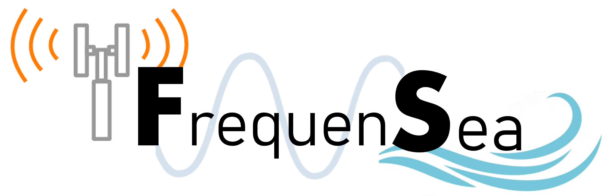

<div id="top"></div>

<!-- PROJECT SHIELDS -->
<!--
*** I'm using markdown "reference style" links for readability.
*** Reference links are enclosed in brackets [ ] instead of parentheses ( ).
*** See the bottom of this document for the declaration of the reference variables
*** for contributors-url, forks-url, etc. This is an optional, concise syntax you may use.
*** https://www.markdownguide.org/basic-syntax/#reference-style-links
-->
[![Contributors][contributors-shield]][contributors-url]
[![Forks][forks-shield]][forks-url]
[![Stargazers][stars-shield]][stars-url]
[![Issues][issues-shield]][issues-url]


<!-- PROJECT LOGO -->
<br />
<div align="center">
  <a href="https://uwaterloo.viewer.foleon.com/2023-capstone/electrical-computer/participants-2">
    
  </a>
  
  <a href="https://github.com/DevonMillerJunk/CapstoneProject">
    
  </a>

  <h3 align="center">FrequenSea</h3>

  <p align="center">
    An adaptable underwater wireless communication platform
    <br />
    <a href="https://github.com/DevonMillerJunk/CapstoneProject"><strong>Explore the docs »</strong></a>
    <br />
    <br />
    <a href="https://github.com/DevonMillerJunk/CapstoneProject">View the Code</a>
    ·
    <a href="https://github.com/DevonMillerJunk/CapstoneProject/issues">Report Bug</a>
    ·
    <a href="https://github.com/DevonMillerJunk/CapstoneProject/issues">Request Feature</a>
  </p>
</div>


<!-- TABLE OF CONTENTS -->
<details>
  <summary>Table of Contents</summary>
  <ol>
    <li>
      <a href="#about-the-project">About The Project</a>
    </li>
    <li>
      <a href="#getting-started">Getting Started</a>
      <ul>
        <li><a href="#prerequisites">Prerequisites</a></li>
        <li><a href="#installation">Installation</a></li>
      </ul>
    </li>
    <li><a href="#usage">Usage</a></li>
    <li><a href="#roadmap">Roadmap</a></li>
    <li><a href="#contact">Contact</a></li>
    <li><a href="#acknowledgments">Acknowledgments</a></li>
  </ol>
</details>


<!-- ABOUT THE PROJECT -->
## About The Project

Every year billions of dollars are invested collecting terabytes of data from underwater ROVs, Remotely Operated Vehicles, that is critical for the operation and maintenance of offshore infrastructure. Current implementations use either wired or acoustic wireless methods to retrieve the information from ROVs. The former is fast, but increases the risk of entanglement, while the latter suffers from high latency and low data rates. The objective of this project is to design a short-range, high-data-rate, wireless, underwater communication system to enable high-speed communication in shallow waters without the use of a bulky wire. Specifically, we use software-based error detection and correction techniques, layered on FM radio encoding to take advantage of the high-data-rate qualities of electromagnetic communication at frequencies that minimize the impacts of poor signal propagation in water. The error correction algorithm and communications circuits are designed based on radio wave, communications, and circuit theory. The main advantages of our solution are the high data rates and lack of physical wire. When integrated with ROVs, our wireless communication system enables easily deployable and maneuverable communications for underwater investigations, which reduces the risk, cost, and time spent on scientific study.

<p align="right">(<a href="#top">back to top</a>)</p>


### Background Knowledge

Some core concepts associated with our project.

* [Radio Transmission](https://www.sciencedirect.com/topics/computer-science/radio-transmission#:~:text=In%20radio%20transmission%2C%20electromagnetic%20power,into%20a%20receiver%20for%20detection.)
* [Underwater Communication](https://www.hindawi.com/journals/wcmc/2019/6470359/)
* [LoRa](https://www.semtech.com/lora/what-is-lora)

<p align="right">(<a href="#top">back to top</a>)</p>


<!-- GETTING STARTED -->
## Getting Started

This network code is meant to be run on a Raspberry-Pi in combination with a [SX1262 LoRa Hat](https://www.waveshare.com/wiki/SX1262_915M_LoRa_HAT#Hardware_Connection.2C_Install_Function.2C_Enable_Raspberry_Pi_Serial_Port.2C_Download_Demo_Program). Specifically,
this code is set up to be run on the North American 915MHz band. If in another region, please use the corresponding publically available frequency band.

### Prerequisites

See guide on initial setup with the raspberry pi [here](https://www.waveshare.com/wiki/SX1262_915M_LoRa_HAT#Using_with_Raspberry_Pi)

### Installation

_Below is an example of how you can instruct your audience on installing and setting up your app. This template doesn't rely on any external dependencies or services._

1. Purchase and set up 2 Raspberry Pis with an SX1262 LoRa Hat.
2. Clone the repo
   ```sh
   git clone https://github.com/DevonMillerJunk/CapstoneProject.git
   ```
3. Set up the data that you wish to transfer
4. Run either the test bench, or custom program on top of the library

<p align="right">(<a href="#top">back to top</a>)</p>


<!-- USAGE EXAMPLES -->
## Usage

With a pair of Raspberry Pi and SX1262 LoRa Hats, one is able to set up a transmitter and receiver. The transmitter can run the transmission test best and the receiver can run the receiving test bench. Depending on the test bench run, stats can be output to the command line.

<p align="right">(<a href="#top">back to top</a>)</p>


<!-- ROADMAP -->
## Roadmap

- [x] Design of Standard
- [x] Basic Test Bench for Antenna Assessment
- [x] Error Encoding and Decoding
    - [x] Implementation of CRC code generation
    - [x] Error Correction through RS decoding
    - [x] Optimization of parameters
- [ ] Network Implementation
    - [x] Packetization of the data
    - [x] Timing and ackknowledgements
    - [x] Integration of Error Encoding and Decoding
    - [x] Retransmission of failed packets
- [x] Advanced Test Bench
    - [x] Basic Test Bench built on top of Network Implementation
    - [x] Metrics Collection and Assessment

See the [open issues](https://github.com/DevonMillerJunk/CapstoneProject/issues) for a full list of proposed features (and known issues).

<p align="right">(<a href="#top">back to top</a>)</p>


<!-- CONTACT -->
## Contact

* Devon Miller-Junk - [dsmiller@uwaterloo.ca](mailto:dsmiller@uwaterloo.ca)
* Johan Alant - [jalant@uwaterloo.ca](mailto:jalant@uwaterloo.ca)
* Yrina Guarisma - [yguarisma@uwaterloo.ca](mailto:yguarisma@uwaterloo.ca)
* Braden Bakker - [bgobakker@uwaterloo.ca](mailto:bgobakker@uwaterloo.ca)

Project Link: [https://github.com/DevonMillerJunk/CapstoneProject](https://github.com/DevonMillerJunk/CapstoneProject)

<p align="right">(<a href="#top">back to top</a>)</p>


<!-- ACKNOWLEDGMENTS -->
## Acknowledgments

Special Thanks to all of the following for their assistance with this project

* [Prof. Amir Khandani](mailto:khandani@uwaterloo.ca)
* [The University of Waterloo](https://uwaterloo.ca/)
* [The Electrical and Computer Engineering Department](https://uwaterloo.ca/electrical-computer-engineering/)

<p align="right">(<a href="#top">back to top</a>)</p>


<!-- MARKDOWN LINKS & IMAGES -->
<!-- https://www.markdownguide.org/basic-syntax/#reference-style-links -->
[contributors-shield]: https://img.shields.io/github/contributors/DevonMillerJunk/CapstoneProject.svg?style=for-the-badge
[contributors-url]: https://github.com/DevonMillerJunk/CapstoneProject/graphs/contributors
[forks-shield]: https://img.shields.io/github/forks/DevonMillerJunk/CapstoneProject.svg?style=for-the-badge
[forks-url]: https://github.com/DevonMillerJunk/CapstoneProject/network/members
[stars-shield]: https://img.shields.io/github/stars/DevonMillerJunk/CapstoneProject.svg?style=for-the-badge
[stars-url]: https://github.com/DevonMillerJunk/CapstoneProject/stargazers
[issues-shield]: https://img.shields.io/github/issues/DevonMillerJunk/CapstoneProject.svg?style=for-the-badge
[issues-url]: https://github.com/DevonMillerJunk/CapstoneProject/issues
[product-screenshot]: images/screenshot.png